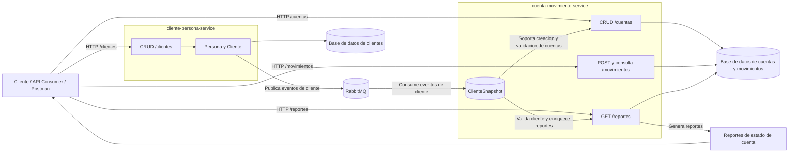

# bank-microservices-challenge

Reto tecnico backend para un sistema bancario simple, implementado con Java y Spring Boot bajo una arquitectura de 2 microservicios orientada a una entrega clara, defendible y alineada con el enunciado.

## Descripcion general

La solucion cubre el flujo principal solicitado en el reto:

- gestion de clientes
- gestion de cuentas
- registro de movimientos
- validacion de saldo no disponible
- reporte de estado de cuenta por cliente y rango de fechas
- comunicacion asincronica entre microservicios
- ejecucion local con Docker Compose
- validacion automatizada con GitHub Actions

### Estructura del repositorio

```text
bank-microservices-challenge/
  cliente-persona-service/
  cuenta-movimiento-service/
  .github/workflows/ci.yml
  docker-compose.yml
  postman_collection.json
  pom.xml
  README.md
```

### Endpoints principales

La API respeta el contrato principal del reto:

- `POST /clientes`
- `GET /clientes`
- `GET /clientes/{clienteId}`
- `PUT /clientes/{clienteId}`
- `DELETE /clientes/{clienteId}`
- `POST /cuentas`
- `GET /cuentas`
- `GET /cuentas/{id}`
- `PUT /cuentas/{id}`
- `DELETE /cuentas/{id}`
- `POST /movimientos`
- `GET /movimientos`
- `GET /movimientos/{id}`
- `GET /reportes?fecha=2022-02-01,2022-02-28&clienteId=2`

### Reglas funcionales clave

- `Cliente` hereda de `Persona`
- `saldoDisponible` inicia con el mismo valor de `saldoInicial`
- movimiento con valor positivo = deposito
- movimiento con valor negativo = retiro
- movimiento con valor `0` no es valido
- si un retiro excede el saldo disponible, la respuesta funcional es `Saldo no disponible`
- los movimientos rechazados no deben alterar saldo ni registrarse

## Arquitectura del sistema

La solucion separa responsabilidades en dos microservicios, cada uno con su propia persistencia y comunicacion asincronica mediante RabbitMQ. `cliente-persona-service` administra Persona y Cliente; `cuenta-movimiento-service` administra cuentas, movimientos y reportes, consumiendo eventos de cliente para mantener un `ClienteSnapshot` local.



Puntos tecnicos clave:

- el consumo HTTP se mantiene desacoplado por contexto: `/clientes` en `cliente-persona-service` y `/cuentas`, `/movimientos`, `/reportes` en `cuenta-movimiento-service`
- RabbitMQ transporta los eventos de cliente creados, actualizados o desactivados
- `cuenta-movimiento-service` no depende de una llamada HTTP sincrona para validar clientes; usa su `ClienteSnapshot` local
- los reportes se generan desde `cuenta-movimiento-service`, apoyados en los movimientos persistidos y en la informacion minima disponible del snapshot

## Estrategia de desarrollo TDD

El backend se desarrollo siguiendo Test-Driven Development como estrategia principal para las funcionalidades de negocio. Cada funcionalidad se trabajo con tests primero, avanzando en el ciclo `RED -> GREEN -> REFACTOR`:

- `RED`: se escriben pruebas que fallan por la razon esperada
- `GREEN`: se implementa el minimo necesario para hacerlas pasar
- `REFACTOR`: se mejora el diseno manteniendo el comportamiento en verde

El historial de commits refleja este flujo con mensajes como `RED: agregar tests fallidos para ...`, `GREEN: implementar ...` y `REFACTOR: mejorar diseno ...` en features como clientes, cuentas, movimientos, reportes y comunicacion asincronica. Esta estrategia ayudo a mantener calidad, trazabilidad y bajo riesgo de regresiones durante la evolucion del proyecto.

## Stack tecnico

- Java 21
- Spring Boot 3.5.x
- Maven multi-module
- Spring Web
- Spring Data JPA
- Bean Validation
- PostgreSQL
- RabbitMQ
- Spring Boot Actuator
- JUnit 5
- Mockito
- Docker y Docker Compose
- GitHub Actions

## Ejecucion local con Docker Compose

### Prerrequisitos

- Docker Desktop o Docker Engine con Docker Compose
- Java 21 y Maven solo si quieres ejecutar pruebas fuera de los contenedores

### Levantar toda la solucion

Desde la raiz del repositorio:

```bash
docker compose up --build
```

Esto levanta:

- `postgres-clientes`
- `postgres-cuentas`
- `rabbitmq`
- `cliente-persona-service`
- `cuenta-movimiento-service`

### Servicios expuestos

- `cliente-persona-service`: `http://localhost:8081`
- `cuenta-movimiento-service`: `http://localhost:8082`
- RabbitMQ Management: `http://localhost:15672`

Credenciales por defecto de RabbitMQ:

- usuario: `bank_user`
- contrasena: `bank_pass`

### Variables de entorno principales

`cliente-persona-service`

- `CLIENTE_PERSONA_PORT`
- `CLIENTES_DB_URL`
- `CLIENTES_DB_USERNAME`
- `CLIENTES_DB_PASSWORD`
- `SPRING_JPA_HIBERNATE_DDL_AUTO`
- `RABBITMQ_HOST`
- `RABBITMQ_PORT`
- `RABBITMQ_USERNAME`
- `RABBITMQ_PASSWORD`

`cuenta-movimiento-service`

- `CUENTA_MOVIMIENTO_PORT`
- `CUENTAS_DB_URL`
- `CUENTAS_DB_USERNAME`
- `CUENTAS_DB_PASSWORD`
- `SPRING_JPA_HIBERNATE_DDL_AUTO`
- `RABBITMQ_HOST`
- `RABBITMQ_PORT`
- `RABBITMQ_USERNAME`
- `RABBITMQ_PASSWORD`

### Verificacion rapida

```bash
curl http://localhost:8081/actuator/health
curl http://localhost:8082/actuator/health
```

Si todo arranco bien, ambos endpoints deben responder con estado `UP`.

### Detener la solucion

```bash
docker compose down
```

Para eliminar tambien los volumenes:

```bash
docker compose down -v
```

## Ejecucion de tests

Para correr la suite principal de ambos microservicios:

```bash
mvn -pl cliente-persona-service,cuenta-movimiento-service test
```

Tambien es util validar la configuracion final de contenedores:

```bash
docker compose config
```

## Coleccion Postman

La coleccion [postman_collection.json](./postman_collection.json) permite validar manualmente los endpoints principales del reto sobre la ejecucion local.

### Variables usadas

- `clientePersonaBaseUrl = http://localhost:8081`
- `cuentaMovimientoBaseUrl = http://localhost:8082`

### Orden recomendado de ejecucion

1. `Clientes`
2. `Cuentas`
3. `Movimientos`
4. `Reportes`

### Ejecucion limpia de validacion

La coleccion esta pensada para ejecutarse sobre una base limpia, porque crea sus propios clientes, cuentas y movimientos de prueba. Si necesitas repetir la validacion desde cero, elimina los volumenes y vuelve a levantar la solucion:

```bash
docker compose down -v
docker compose up --build
```

Luego importa y ejecuta [postman_collection.json](./postman_collection.json) usando las variables locales indicadas arriba. El comando `down -v` elimina los datos persistidos de PostgreSQL y evita conflictos por identificaciones o numeros de cuenta duplicados.

La coleccion incluye requests para:

- crear clientes de ejemplo
- listar clientes
- consultar clientes por id
- actualizar clientes
- desactivar clientes
- validar identificacion duplicada
- crear cuentas de ejemplo
- listar cuentas
- consultar cuentas por id
- actualizar cuentas
- desactivar cuentas
- validar numero de cuenta duplicado
- validar saldo inicial negativo
- validar cliente inexistente o inactivo al crear cuentas
- registrar depositos
- registrar retiros
- consultar movimientos por id
- validar movimiento con valor cero
- validar el caso `Saldo no disponible`
- consultar movimientos
- validar que `PUT /movimientos/{id}` y `DELETE /movimientos/{id}` rechazan movimientos aplicados por integridad transaccional
- consultar el reporte por rango de fechas y cliente

### Nota sobre el reporte

La coleccion conserva el rango de fechas del PDF (`2022-02-01` a `2022-02-28`). Si se ejecuta sobre una base limpia y los movimientos se crean hoy, el reporte puede devolver cuentas con lista de movimientos vacia porque los movimientos se registran con la fecha actual del sistema.

## BaseDatos.sql

El repositorio incluye [BaseDatos.sql](./BaseDatos.sql) en la raiz como entregable del reto tecnico.

El script contiene el esquema de base de datos necesario para los dos microservicios:

- tablas principales
- claves primarias
- claves foraneas donde aplica
- restricciones `UNIQUE`
- indices utiles para consultas por cliente, cuenta y fecha

`BaseDatos.sql` puede usarse como referencia o carga manual del esquema. Docker Compose no ejecuta automaticamente datos semilla para evitar conflictos con la coleccion Postman, que crea sus propios datos durante la validacion.

## CI/CD

El repositorio incluye el workflow [`.github/workflows/ci.yml`](./.github/workflows/ci.yml).

Actualmente la automatizacion implementada cubre integracion continua:

- se ejecuta en `push` y `pull_request` hacia `main` y `develop`
- usa Java 21
- cachea dependencias Maven
- ejecuta:

```bash
mvn -pl cliente-persona-service,cuenta-movimiento-service test
```

Esto permite validar build y pruebas automaticamente antes de integrar cambios.
